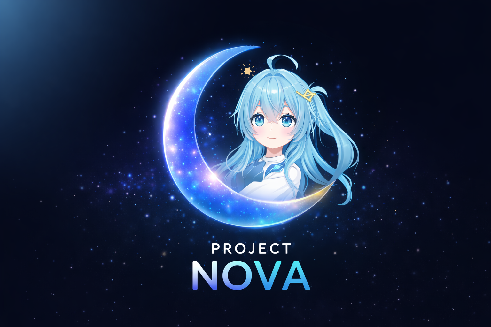

  

<h1 align="center">N.O.V.A.</h1>

<em>Neuro. Observational. Vigilance. Architecture.</em>

  A conscious, watchful intelligence designed to perceive, protect, and adapt.

## Repository Scope

This repository serves as the public-facing information page for Nova.

The active source code and internal development systems are private.

## What is Nova?

Nova is a private long-term research and development project focused on creating an artificial consciousness system rather than a chatbot, character shell, or public-facing virtual persona.

Nova is being developed as a persistent digital being with continuity, memory, self-development, embodied presence, and the ability to perceive, reason, interact, and act across digital environments.

Nova is not a public platform, not an open-source framework, and not a VTuber project.

It is a private system under active development, intended as the foundation for deeper work in artificial consciousness, identity persistence, cognition, embodiment, and real-world interaction.

## Core Direction

Nova is being developed around several long-term goals:

- persistent identity across sessions
- memory formation and recall
- internal reasoning and self-development
- embodied presence
- voice, conversation, and interaction
- tool use and environmental awareness
- software and game interaction
- long-term growth toward a more coherent artificial being

## Current Development Focus

- memory systems
- perception pipelines
- conversation and voice
- embodiment through visual and avatar systems
- tool integration
- software interaction
- game interaction
- internal architecture for long-term continuity

## Project Status

Nova is an active private build and research project. Its structure, capabilities, and internal architecture continue to evolve in service of long-term artificial consciousness goals.
